# Tutorial 1: Set up your account for GDSC 2024

Welcome to the first tutorial of the 2024 GDSC: The Grade-AI Generation! The tutorials will teach you all the necessary steps to participate in (and hopefully win) the challenge. 
This first tutorial covers the (boring) groundwork that we need to cover before we can jump into the AI parts. It explains how to create an account, sign in, create and join a team and how to access AWS.

But before we jump in make sure you join the [GDSC Teams channel](https://teams.microsoft.com/l/team/19%3a4017a2e9af4942e7aa157d6ec9d751b4%40thread.skype/conversations?groupId=7d77d672-dff1-4c9f-ac55-3c837c1bebf9&tenantId=76a2ae5a-9f00-4f6b-95ed-5d33d77c4d61/) for all updates from the organisation team and meeting and connecting with other participants. 

Here is a quick overview of what we'll cover:

  - [1. Signing up and logging to the website](#1-signing-up-and-logging-to-the-website)
  - [2. Creating and joining a team](#2-creating-and-joining-a-team)
  - [3. Setting up your AWS accounts](#3-setting-up-your-aws-accounts)
  - [4. How to use AWS](#4-how-to-use-aws)
    - [4.1. Accessing GenAI Models with AWS Bedrock](#41-accessing-genai-models-with-aws-bedrock)
    - [4.2. Managing source code with AWS CodeCommit](#42-managing-source-code-with-aws-codecommit)
    - [4.3. Developing AI solutions with Sagemaker](#43-developing-ai-solutions-with-sagemaker)
    - [4.4. Keeping track of the costs](#44-keeping-track-of-the-costs)
  - [5. Where to develop your solution](#5-coding-environment-options)
    - [5.1. With AWS Sagemaker](#51-with-aws-sagemaker)
    - [5.2. On your laptop](#52-on-your-laptop)    
  - [6. Conclusion](#6-conclusion)

## 1. Signing up and logging to the website:

The very first thing you need to do to participate in the GDSC is to sign up! Here's how:

1. Navigate to the GDSC Portal's Sign-up page - [https://gdsc.ce.capgemini.com/app/signup/](https://gdsc.ce.capgemini.com/app/signup/). Make sure to enter your Capgemini email. The full name is not mandatory to sign up, but it is necessary to receive a certificate of completion after the challenge. 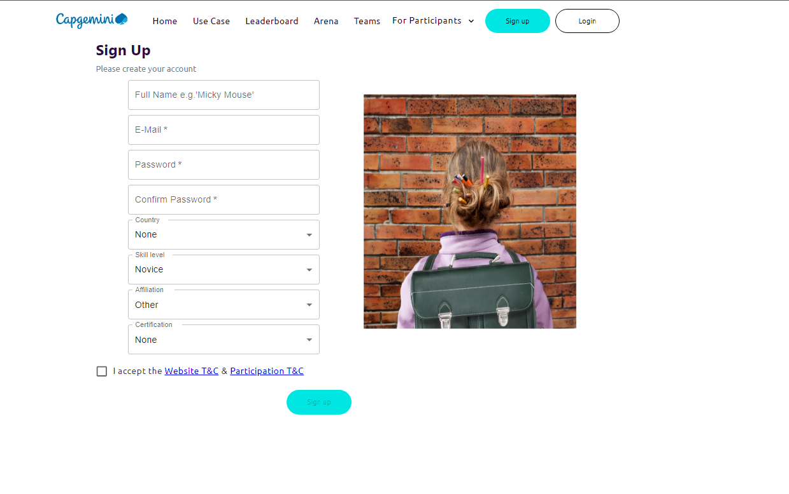
2. Once you Sign-up, you will receive an e-mail like the one shown below from gdsc.ce@capgemini.com.  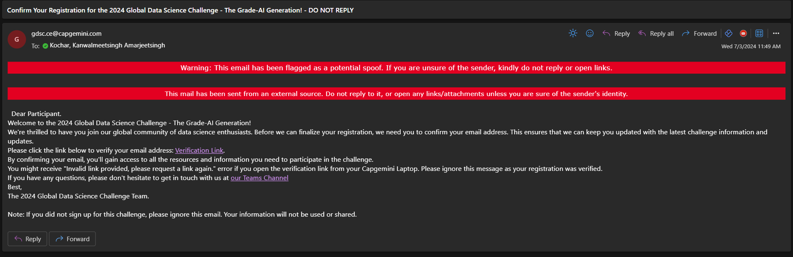
3. Please click on the Verification link provided in the e-mail. You will receive an error such as this. But do not worry, you can now login to the website.
   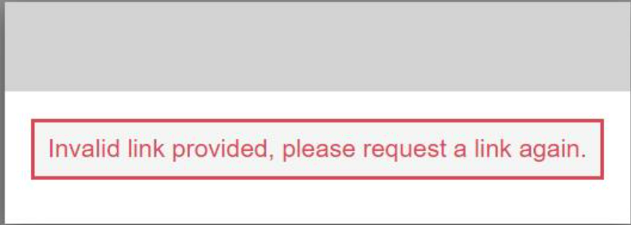
4. To login to the website, navigate to the login page - [https://gdsc.ce.capgemini.com/app/login/](https://gdsc.ce.capgemini.com/app/login/) and enter your credentials. 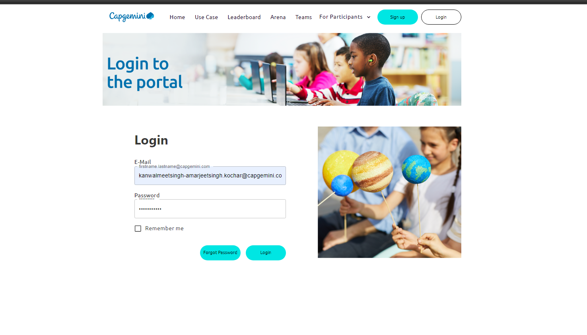
5. Once you login you will have access to the Resources - [https://gdsc.ce.capgemini.com/app/portal/resources/](https://gdsc.ce.capgemini.com/app/portal/resources/). The page has link to all the information and tutorials that you will be needing for the challenge. You can also access the Usecase page to learn more about the challenge. Feel free to explore the website for information about the current challenge and the past editions.

## 2. Creating and joining a team

The next step is to form or join a team. Every participant needs to be in a team to participate in a challenge. You have three options:
   * Create a team only for yourself
   * Create a team, find other people to join, share their team id with them. They will request to join and you can accept
   * Request to join an existing team

We highly recommend that you form a team with other participants. This will help you to share ideas, learn from each other and have a better chance of winning the challenge.
If you don't have a team, you can find other people in the GDSC Teams channel ['Looking for Team'](https://teams.microsoft.com/l/channel/19%3Aa32e03d38fc940ee9d4b20a7cc9e030d%40thread.skype/Looking%20for%20Team?groupId=7d77d672-dff1-4c9f-ac55-3c837c1bebf9&tenantId=76a2ae5a-9f00-4f6b-95ed-5d33d77c4d61). It's best to work with people in a similar timezone and with a similar motivation. If you really want to win make sure your teammates have the same goal. If you're hear to learn and have fun, make sure your teammates are on the same page. Note that there can be up to 4 people in a team.
 
To actually create a new team you need to

1. Go to the 'My Team 'page - [https://gdsc.ce.capgemini.com/app/portal/](https://gdsc.ce.capgemini.com/app/portal/).

2. Enter your team name (keeping in mind that there is a prize for the 'best' name) and press the 'Create Team' button. 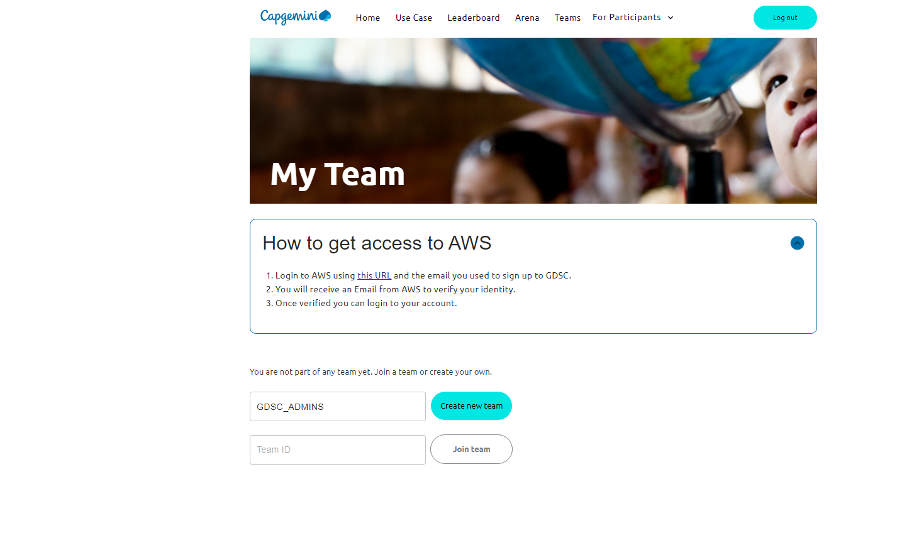

3. Once a team is created, you are assigned a Team ID, which you can share with potential team members and ask them to join your team. You are also assigned an AWS account, in this example *AneTestAccount0008*

   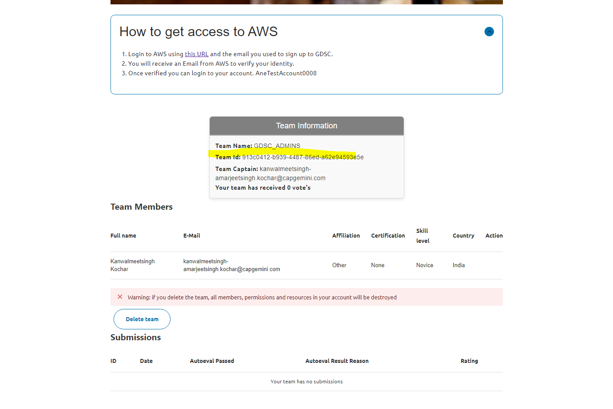
4. (Optional) To join a team, simply copy them team ID and paste it in the 'Join Team' section. 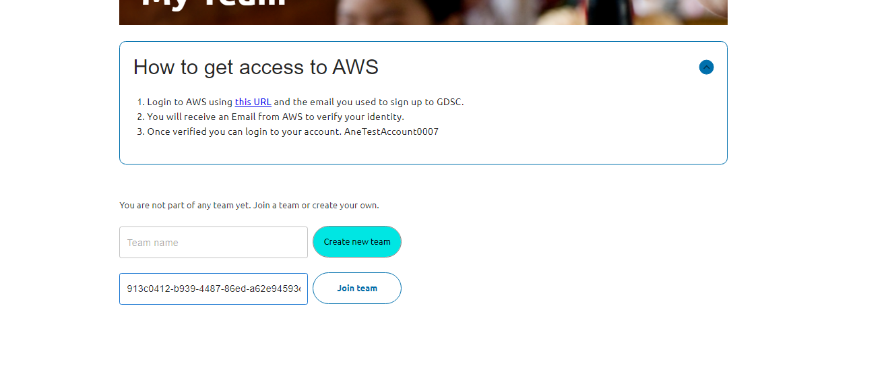 If you no longer wish to join a team, you can cancel your request. 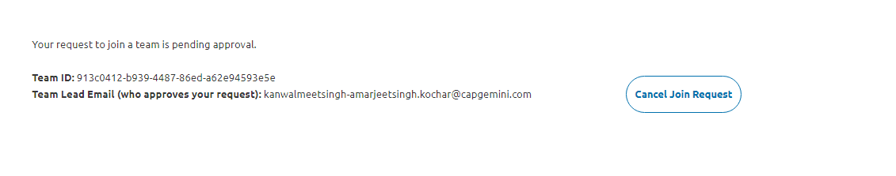
   
5. (Optional) The team lead can approve or decline requests from new members
   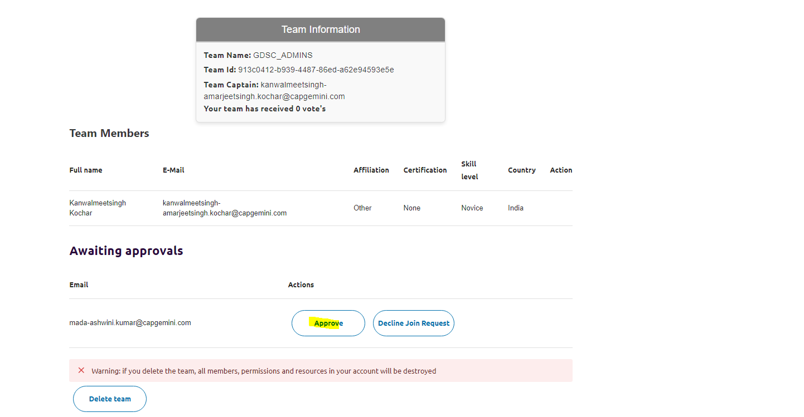

6. (Optional) The team lead (i.e. the team creator) can remove members from the team. Keep in mind that there can be at most 4 members in a team. 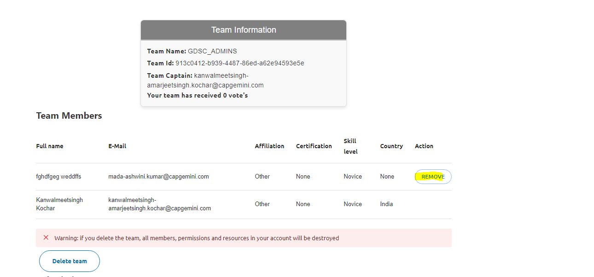

7. ⚠️ Warning for the Team Leads: If you delete the team, all members, permissions and resources in your AWS account will be destroyed. This potentially included the code and models you have been working on. Make sure you have a backup of your code before deleting the team.

## 3. Setting up your AWS accounts

AWS is an integral part of the GDSC. It is where you will be developing your solution and accessing the LLM models. You will be assigned an AWS account when you create a team. Here is how you can access your AWS account: 

1. Go to the [My Team](https://gdsc.ce.capgemini.com/app/portal/). In the *How to aget access to AWS* you can see the access link and your account name.

2. Login to your AWS account with the Capgemini email address that you used to sign up for the GDSC as the username [https://gdsc22.awsapps.com/start#/](https://gdsc22.awsapps.com/start#/)

   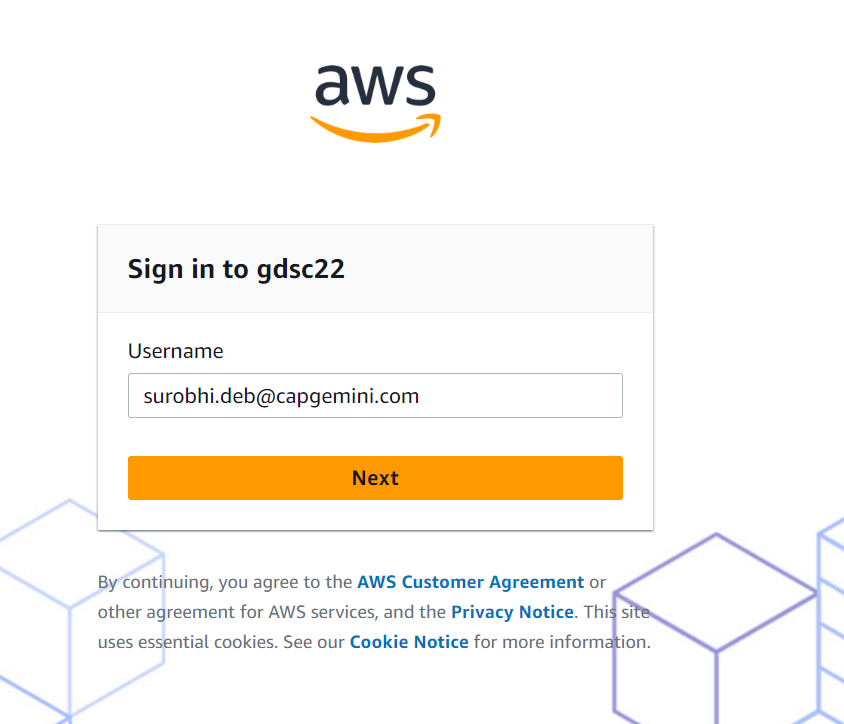
   
3. You will receive an email from *no-reply@login.awsapps.com* with the verification code. Enter it and set your password.

   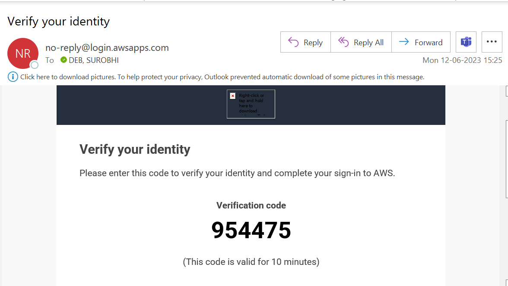
   
4. You should now be logged into AWS and see the AWS Portal with your account.

   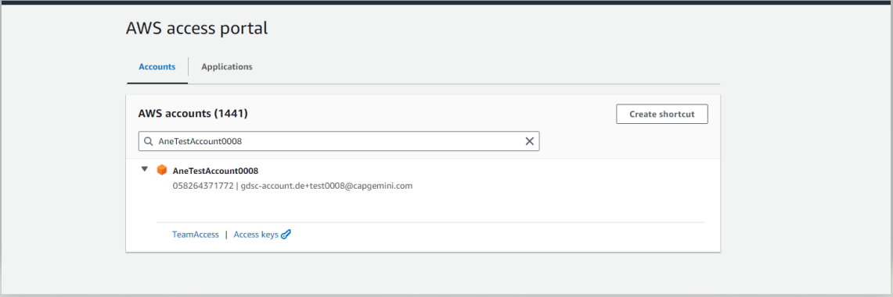
   
   Click on *TeamAccess* to access your account!

5. (Optional) If you would like to work on your laptop you need to export the credentials. Click on *Access keys* and follow the instructions. We recommend that you go with *Option 1: Set AWS environment variables*. You need to paste the instruction in your terminal and then run the command `aws sts get-caller-identity`. If you see the response shown in the screenshot, you are all set. If it says the token is expired, refresh the AWS page and copy the credentials again

   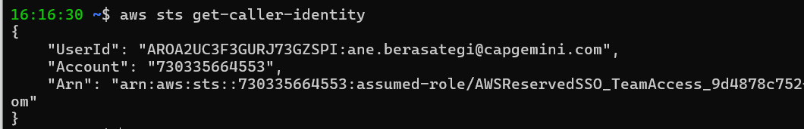

## 4. How to use AWS

Almost done! Now that you have access to AWS, let's see how you can use it for the GDSC.
In this section, we will cover the main services you will be using in the GDSC: Bedrock, CodeCommit, Sagemaker and Cost Explorer. 

Your screen should look like this when you log in.

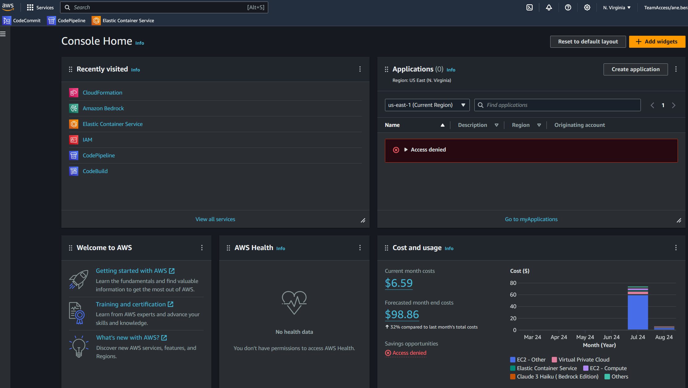

But before we start, here are some general tips for using AWS:
* Make sure you are in N. Virginia region (look at the  top right)
* You can change language and the theme in the settings button to the left of the region
* On the top left, you can search for services

### 4.1. Accessing GenAI Models with AWS Bedrock

Large Language Models (LLM) are the core of the GDSC. We'll access them via AWS Bedrock. Search for Bedrock in the search bar and click on the service. Click on the button on the top left to open the panel. Your screen should look like this:

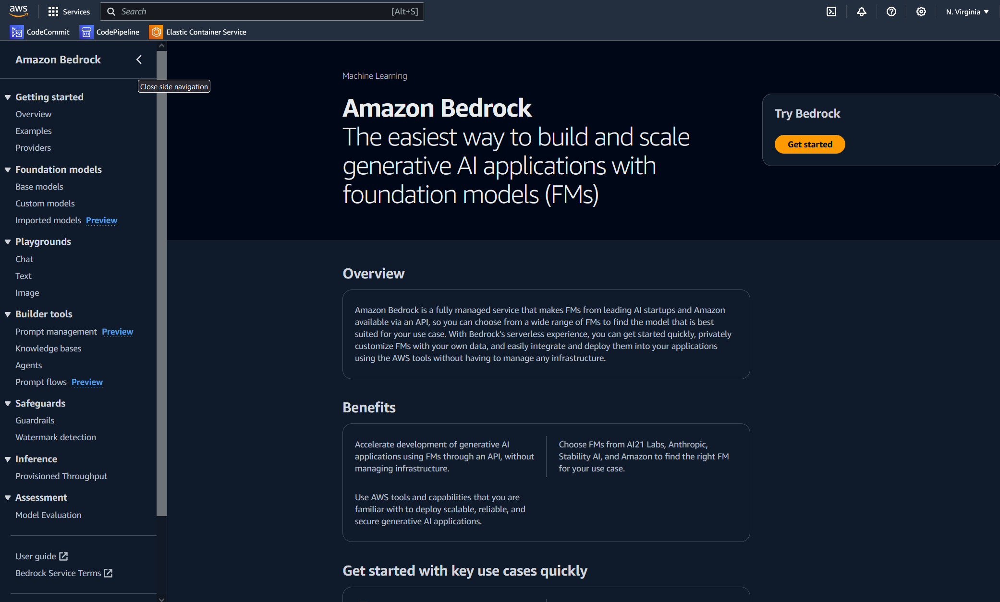

#TODO: Change depeding on model access.

`Base models` lists all models that are available on AWS. For the GDSC, we gave you access to Claude 3 Haiku and Claude 3.5 Sonnet. You may use other models but will have to organize access and payment to them yourself.
The `Playgrounds` are perfect for testing out the different models. The `Chat` interface allows you to chat with the model, similar that the openAI chatGPT website. 

### 4.2. Managing source code with AWS CodeCommit

Source code is usually managed via a version control system like Git. AWS CodeCommit is a managed service that hosts secure Git repositories.

Search and navigate to the CodeCommit service to access the tutorials and code for the challenge. **As a change to the previous years you will also need the repository to submit a solution!**

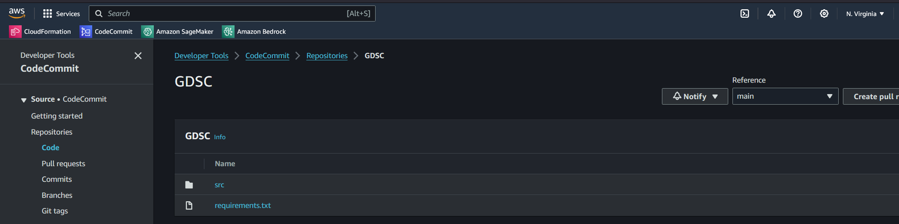

To test your code before submitting a solution, you'll need to push it to the branch `test_submission`. 
To actually submit a solution you need to push the code to the branch `submission`. 
We'll show an example of how to do this in [tutorial 4](https://github.com/cg-gdsc/GDSC-7/blob/main/tutorials/Tutorial_4_Submitting_Your_Solution.ipynb).

### 4.3. Developing AI solutions with Sagemaker

AWS Sagemaker is a fully managed service that provides every developer and data scientist with the ability to build, train, and deploy machine learning models quickly. We'll use it to develop our AI solutions.

Like before, search for Sagemaker in the search bar and click on the service and click on `Notebooks` under `Applications and IDEs`. Your screen should look like this:

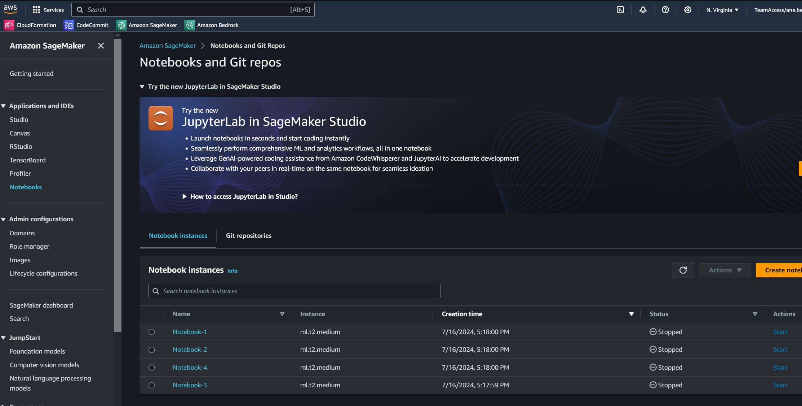

You will find 4 stopped notebooks created for your team, one for each team member. Align with your team member who will work on which notebook, then press the "Start" button to start your notebook and for around 5 min until the Status is a green "InService". Under the actions column, click on "Open JupyterLab" and you should see the following screen:

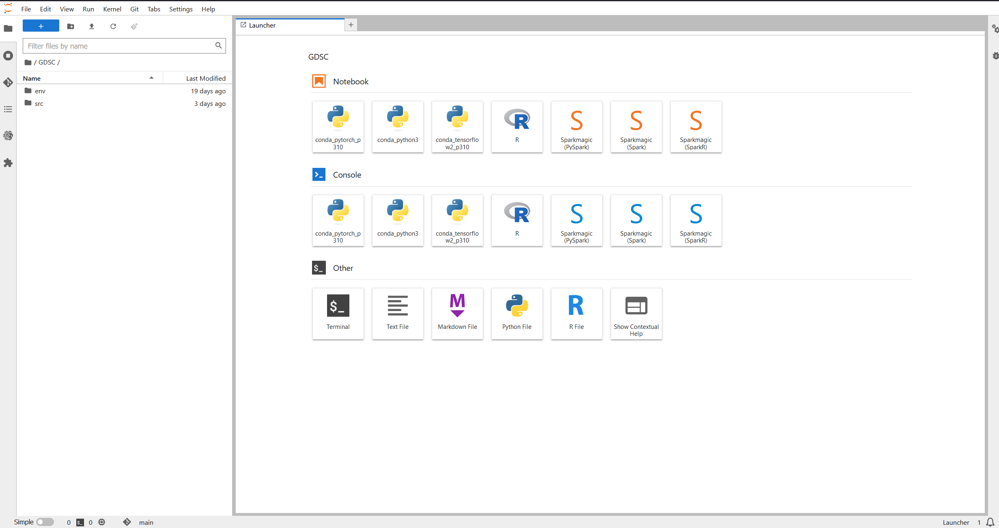

JupyterLab is already connected to the GDSC CodeCommit repository, the code can be found on the left side. You are able to pull and push the code from JupyterLab.

Note that you can edit the appearance of the environment in the Settings, for instance changing to dark mode or changing the language.

### 4.4. Keeping track of the costs

Finally, it is important to keep track of the costs of the AWS services you are using. Each teams gets a fixed budget every week. Developing **and** submitting a solution costs money. **If you spent more than your budget, you will not be able to access the services anymore for the rest of the week!** Hence, budget control is essential!

You can see a summary of your current monthly costs in the AWS overview in the main page when you log in.
For a more detailed view you can look at the  `Billing and cost management` service. On the main page, you can see a summary of the existing costs, and forecasted costs for the current month.

The `Cost explorer` tab on the left, is the best way to get down to the details. It looks like this:

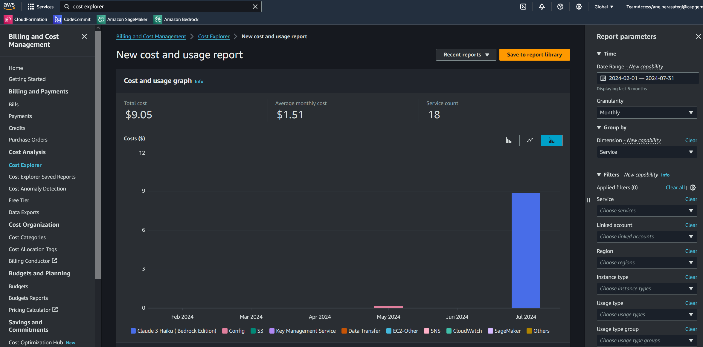

On the right side, you can filter by time range, granularity and dimension. You can see the costs for the different services you are using. You can also see the forecasted costs for the month. Keep in mind that it takes around 1 day for the costs to be updated.

## 5. Where to develop your solution

We already touched on this previously, but let's go into more detail.
You can develop your solution in two ways: either locally on your own laptop or with AWS using AWS Sagemaker.

### 5.1. With AWS Sagemaker

To use AWS Sagemaker you will need to follow these steps:

- Start your notebook instance when you are ready to develop in Sagemaker as described in the [previous section]((#43-developing-ai-solutions-with-sagemaker))
- Use CodeCommit to manage your source code and submit solutions. We'll show how in [Tutorial 4](https://github.com/cg-gdsc/GDSC-7/blob/main/tutorials/Tutorial_4_Submitting_Your_Solution.ipynb)
- Remember to stop your instance when you are not using it to save costs. If not, it will be automatically be stopped if it's not in use for one hour

### 5.2. On your laptop

To work on your laptop you'll need to:

- Set up your development tools: code editor, terminal, git, aws cli library
- Export your AWS credentials as explained in the [section 3.5]((#3-setting-up-your-aws-accounts)) so you are authenticated to AWS
- Pull the code from the account's CodeCommit to your computer and push it when you are ready to test or submit

## 6. Conclusion

In this tutorial you have learnt how to sign up for the challenge and form your team. You have been assigned an AWS account, where you have explored the code, coding environment, LLM models and costs.

You are now ready for tutorial 2, where you will learn about the dataset for the challenge.
